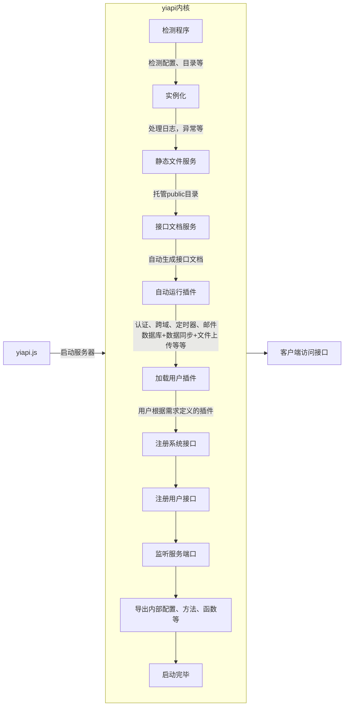

# yiapi（易接口）启动流程

下图演示了 `yiapi` 的启动流程

```mermaid
flowchart LR
  subgraph yiapi内核
    direction TB

    导出内部数据[导出内部配置、方法、函数等]

    检测程序 -- 检测配置、目录等 --> 实例化 -- 处理日志，异常等 --> 静态文件服务-- 托管public目录 --> 接口文档服务 -- 自动生成接口文档 --> 自动运行插件 -- 认证、跨域、定时器、邮件
    数据库+数据同步+文件上传等等 --> 加载用户插件 -- 用户根据需求定义的插件 --> 注册系统接口 --> 注册用户接口 --> 监听服务端口 --> 导出内部数据 --> 启动完毕

  end

  yiapi.js -- 启动服务器 --> yiapi内核 --> 客户端访问接口
```
