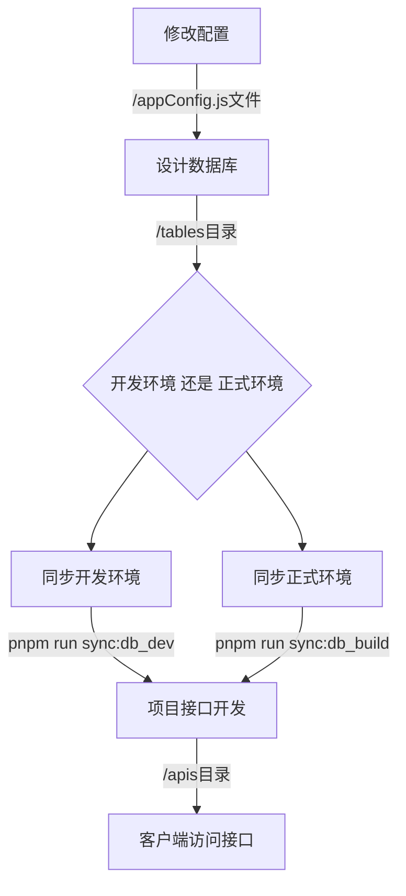

# yiapi 开发流程

下图演示了 `yiapi` 的开发流程

```mermaid
flowchart TB

  修改配置 -- /appConfig.js文件 --> 设计数据库 -- /tables目录 --> 同步数据库{开发环境 还是 正式环境}

  同步数据库 --> 同步开发环境 -- pnpm run sync:db_dev --> 项目接口开发
  同步数据库 --> 同步正式环境 -- pnpm run sync:db_build  --> 项目接口开发


  项目接口开发 -- /apis目录 --> 客户端访问接口

```
