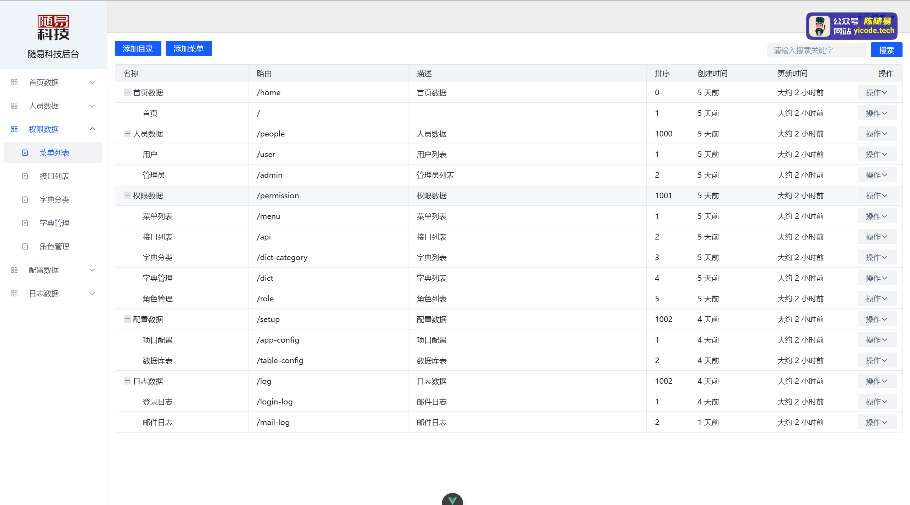
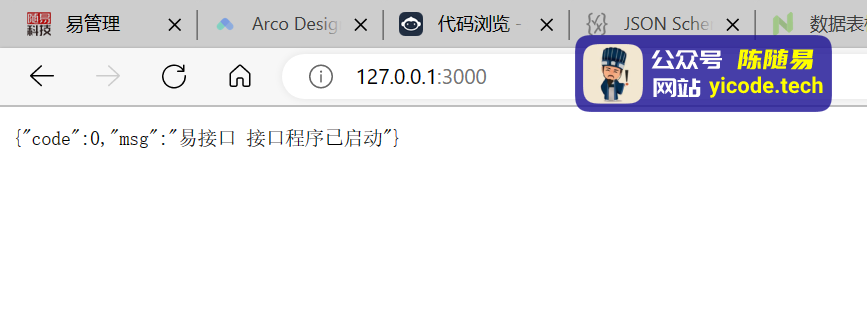

# yiapi（易接口）

基于 `fastify` 进行深度封装的 `nodejs` 接口开发框架

本 `yiapi` 框架使用 `GPL v3` 协议， `开源`、`免费`、`可商用` 但 `不能二次开发`

## 作者

| 属性     | 值                                                    |
| -------- | ----------------------------------------------------- |
| 姓名     | 陈随易                                                |
| 性别     | 男                                                    |
| 出生年月 | 1993 年 10 月                                         |
| 职业     | 基层小码农                                            |
| 就业时间 | 2015 年 9 月                                          |
| 性格     | 喜欢安静，喜欢分享，喜欢钻研                          |
| 爱好     | 敲代码，写小说，看电影，算命                          |
| 微信     | c91374286                                             |
| 扣扣     | 24323626                                              |
| 邮箱     | bimostyle@qq.com                                      |
| 知乎     | [知乎陈随易](https://www.zhihu.com/people/chensuiyi)  |
| 掘金     | [掘金陈随易](https://juejin.im/user/1239904846873326) |
| 码云     | [码云陈随易](https://gitee.com/banshiweichen)         |
| github   | [github 陈随易](https://github.com/chenbimo)          |
| 交流探讨 | 创建了全球顶级程序员微信交流群，加入交流请加我微信    |

## 特点

-   只需简单配置，立即上手开发
-   数据库表通过代码配置，一键同步
-   自动生成接口文档
-   自带权限、角色、管理、日志等基础功能
-   自带邮件发送、文件上传等功能
-   自带日志打印和日志分割功能

## 效果

使用 `yiapi` + `vue3` 研发的免费开源的 `易管理` 后台管理系统



## 场景

-   非关键型、小型项目、博客系统、论坛系统、官网、后台管理等

## 安装

默认使用 `pnpm` 作为 `nodejs` 包管理工具

如未安装，请使用如下命令安装，否则运行项目会有提示信息

```bash
npm install -g pnpm
```

全局安装 `dlyicode` 官方资源下载工具

```bash
npm install -g dlyicode
```

全局安装开发环境下的自动重启工具 `nodemon`

```bash
npm install -g nodemon
```

## 下载

安装完毕后，使用 `vscode` 编辑器打开一个空目录

然后打开编辑器中的控制台界面，在命令行输入 `dlyicode` 并回车，按提示操作即可。

```bash
> dlyicode

ℹ 开发者：随易科技（https://yicode.tech）
-----------------------------------------
? 选择下载类型 官方资源
? 选择从哪里下载 淘宝仓库 - npmmirror.com
? 选择要下载的包 yiapi-free 易接口基础模板
? 输入要下载的版本（默认下载最新版本） latest
✔ 资源已下载成功!
```

下载后的项目结构

```bash
├───📁 addons/
│   └───📁 demo/
│       └───...
├───📁 apis/
│   └───📁 news/
│       └───...
├───📁 config/
│   └───📄 appConfig.js
├───📁 public/
│   ├───📁 2023/
│   │   └───...
│   └───📄 .gitkeep
├───📁 tables/
├───📄 .gitignore
├───📄 .prettierrc
├───📄 nodemon.json
├───📄 package.json
├───📄 pm2.config.cjs
├───📄 README.md
├───📄 syncDatabase.js
└───📄 yiapi.js
```

## 立即体验

1. 在 `appConfig.js` 文件中配置好 `mysql`和 `redis` 参数
2. 执行 `pnpm run dev` 运行接口
3. 浏览器访问 `http://127.0.0.1:3000`
4. 接口文档 `http://127.0.0.1:3000/docs`



## 开发流程

1. 在 `appConfig.js` 文件中配置好 `mysql`和 `redis` 参数
2. 在 `tables` 目录中定义好表结构
3. 执行 `pnpm run sync` 同步表结构到数据库
4. 在 `apis` 目录中写好接口
5. 执行 `pnpm run dev` 运行接口

可以看到，使用 `yiapi` 开发接口功能，核心步骤只有 `2` 步

1. 定义表结构
2. 开发接口

而且表结构和接口开发也非常简单。

## 表结构定义

```json
// table_config.json
{
    "name": "数据表配置",
    "fields": {
        "name": {
            "type": "string",
            "comment": "表名称",
            "length": 50,
            "default": ""
        },
        "code": {
            "type": "string",
            "comment": "表编码",
            "length": 50,
            "default": "",
            "options": ["unique"]
        },
        "value": {
            "type": "string",
            "comment": "表字段",
            "length": 10000,
            "default": ""
        },
        "sort": {
            "type": "bigint",
            "comment": "排序",
            "default": 0
        },
        "describe": {
            "type": "string",
            "comment": "描述",
            "length": 500,
            "default": ""
        }
    }
}
```

## 接口开发

```javascript
// 导入 yiapi 对象
import * as yiapi from '@yicode/yiapi';

// 用于获取接口信息的函数
const apiInfo = await yiapi.utils.fnApiInfo(import.meta.url);

// 接口参数验证配置
export const apiSchema = {
    summary: `查询资讯列表`,
    tags: [apiInfo.parentDirName],
    description: `${apiInfo.apiPath}`,
    body: {
        type: 'object',
        title: '查询资讯列表接口',
        properties: {
            category_id: yiapi.utils.fnSchema(yiapi.schemaField.pid, '资讯分类'),
            page: yiapi.utils.fnSchema(yiapi.schemaField.page, '第几页'),
            limit: yiapi.utils.fnSchema(yiapi.schemaField.limit, '每页数量'),
            keywords: yiapi.utils.fnSchema(yiapi.schemaField.keywords, '搜索关键字')
        },
        required: ['category_id']
    }
};

export default async function (fastify, opts) {
    // 创建一个 post 协议的接口，接口地址为 /news/select
    fastify.post(`/${apiInfo.pureFileName}`, {
        schema: apiSchema,
        config: {},
        handler: async function (req, res) {
            const trx = await fastify.mysql.transaction();
            try {
                // 查询用户是否存在
                let newsCategoryModel = trx.table('news').modify(function (db) {
                    if (req.body.category_id > 0) {
                        db.where('category_id', req.body.category_id);
                    }
                });

                // 记录总数
                let { total } = await newsCategoryModel
                    .clone() //
                    .count('id', { as: 'total' })
                    .first();

                // 记录列表
                let rows = await newsCategoryModel
                    .clone() //
                    .orderBy('created_at', 'desc')
                    .offset(yiapi.utils.fnPageOffset(req.body.page, req.body.limit))
                    .limit(req.body.limit)
                    .select();

                await trx.commit();

                // 查询成功，返回数据
                return {
                    ...yiapi.appConfig.httpCode.SELECT_SUCCESS,
                    data: {
                        total: total,
                        rows: rows,
                        page: req.body.page,
                        limit: req.body.limit
                    }
                };
            } catch (err) {
                // 查询失败，回滚数据
                fastify.log.error(err);
                await trx.rollback();
                return yiapi.appConfig.httpCode.SELECT_FAIL;
            }
        }
    });
}
```

## 部署

`yiapi` 使用 `pm2` 进行正式环境的部署和管理

安装 `pm2`

```bash
npm install -g pm2
```

正式环境运行

```bash
npm run build
```

`反向代理`、`https`、`静态文件托管` 等

推荐使用 `caddy` ，简单、方便、高效，自动配置域名的 `https`

## 总结

使用 `yiapi` 开发后端接口就是这么简单，全部围绕着 `创建表结构` 和 `开发业务接口` 来进行。

真正做到了简单易用，方便快捷！

`yiapi` 的详细使用文档，也将围绕着这 `2` 个核心概念，进行展开，让我们的接口开发，充满欢声笑语。

详细文档地址 [易文档](https://doc.yicode.tech)
